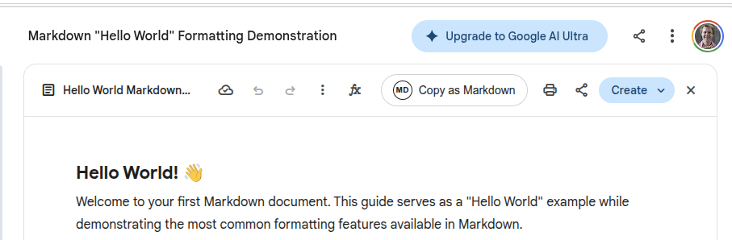

# Gemini Canvas — Copy as Markdown

A [Tampermonkey](https://www.tampermonkey.net/) userscript that adds a **"Copy as Markdown"** button to the Canvas toolbar in [Google Gemini](https://gemini.google.com/).




## What it does

When Google Gemini opens a Canvas panel (the side editor for documents, code, etc.), this script injects an extra toolbar button. Clicking it converts the Canvas content to clean Markdown and copies it to your clipboard.

**Supported formatting:**

| Element | Markdown output |
|---|---|
| Headings (h1–h6) | `#` – `######` |
| Bold / Italic / Strikethrough | `**bold**` / `*italic*` / `~~strike~~` |
| Ordered & unordered lists | `1.` / `-` (with nesting) |
| Code blocks & inline code | Fenced ` ``` ` blocks / `` `inline` `` |
| Blockquotes | `>` |
| Tables | Pipe tables with header separator |
| Links & images | `[text](url)` / `` |
| Horizontal rules | `---` |

## Installation

### Step 1 — Install Tampermonkey

Tampermonkey is a browser extension that lets you run custom userscripts on any website.

| Browser | Link |
|---|---|
| **Chrome** | [Chrome Web Store](https://chrome.google.com/webstore/detail/tampermonkey/dhdgffkkebhmkfjojejmpbldmpobfkfo) |
| **Firefox** | [Firefox Add-ons](https://addons.mozilla.org/en-US/firefox/addon/tampermonkey/) |
| **Edge** | [Edge Add-ons](https://microsoftedge.microsoft.com/addons/detail/tampermonkey/iikmkjmpaadaobahmlepeloendndfphd) |
| **Safari** | [Mac App Store](https://apps.apple.com/app/tampermonkey/id1482490089) |
| **Opera** | [Opera Add-ons](https://addons.opera.com/en/extensions/details/tampermonkey-beta/) |

1. Click the link for your browser above.
2. Click **Add to [Browser]** / **Install** and confirm the permissions prompt.
3. You should see the Tampermonkey icon (a dark square with two circles) in your browser toolbar.

### Step 2 — Install the userscript

**Option A — One-click install (easiest)**

Click the link below. Tampermonkey will recognise the `.user.js` file and offer to install it:

> **[Install gemini-copy-markdown.user.js](https://raw.githubusercontent.com/smhanov/tampers/main/gemini-copy-markdown.user.js)**

*(Update the URL above once you have pushed to GitHub.)*

Click **Install** in the Tampermonkey dialog that appears.

**Option B — Manual install**

1. Click the **Tampermonkey icon** in your browser toolbar.
2. Select **Create a new script…**
3. Delete any boilerplate code in the editor.
4. Copy the entire contents of [`gemini-copy-markdown.user.js`](gemini-copy-markdown.user.js) and paste it into the editor.
5. Press **Ctrl+S** (or **⌘S** on Mac) to save.

### Step 3 — Use it

1. Go to [gemini.google.com](https://gemini.google.com/).
2. Start a conversation that opens a **Canvas** panel (e.g. ask Gemini to write a document).
3. In the Canvas toolbar (top-right area, next to Print / Share / Create), you will see a new **clipboard icon** button.
4. Click it — the Canvas content is converted to Markdown and copied to your clipboard.
5. Paste it anywhere (VS Code, GitHub, Notion, etc.).

## Updating

If you installed via the raw GitHub URL (Option A), Tampermonkey will check for updates automatically. You can also force an update:

1. Click the **Tampermonkey icon** → **Dashboard**.
2. Find **Gemini Canvas - Copy as Markdown** in the list.
3. Click the script name to open it, then go to the **Settings** tab.
4. Under **Updates**, click **Check for updates**.

## Uninstalling

1. Click the **Tampermonkey icon** → **Dashboard**.
2. Find **Gemini Canvas - Copy as Markdown**.
3. Click the **trash can icon** on the right to remove it.

## How it works

- The script watches the DOM with a `MutationObserver` for the Canvas toolbar (`toolbar.extended-response-toolbar`).
- When detected, it injects a button into the `.action-buttons` area alongside the native Print / Share / Create buttons.
- On click, it reads the HTML from the ProseMirror editor inside the Canvas (`.immersive-editor .ProseMirror`) and recursively converts each element to Markdown.
- The result is copied to the clipboard using `GM_setClipboard` (Tampermonkey API) with a `navigator.clipboard` fallback.

## Contributing

Pull requests and issues are welcome. This is a small single-file script — feel free to fork and adapt.

## License

[MIT](LICENSE)
